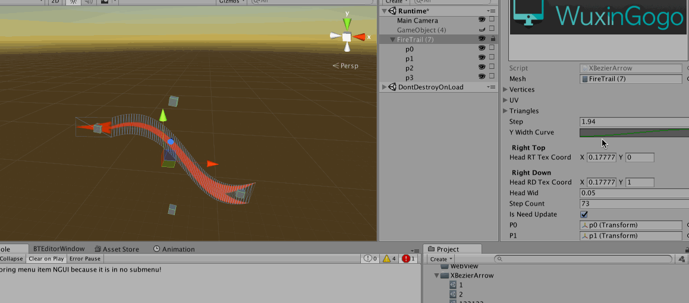
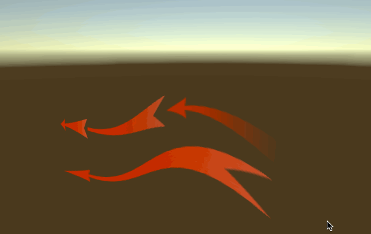

#Unity3D Bezier Arrow

## Intro

此项目包含了基于Unity3D实现的三次贝塞尔曲线箭头，用户可以在Unity3D中创建高定制的Bezier曲线。

要运行此项目，你需要拷贝WuxingogoExtension插件的基础功能。

https://github.com/wuxingogo/WuxingogoExtension

将此插件目录下的WuxingogoExtension拷贝至你项目的Plugins目录下

## Features

* 自定义曲线的贴图
* 在Editor或者Runtime模式下可以保存当前的数据到ScriptableObject中，在需要时创建已经保存好的模板曲线。
* 自定义曲线的精细程度(Mesh Details)
* 使用AnimationCurve实现的曲线宽度定制.

 
 

##Copyright, License & Contributors
-----
MIT license

Contcat:52111314ly@gmail.com, 52111314ly@sina.com

You can join my QQ:1975007286.
